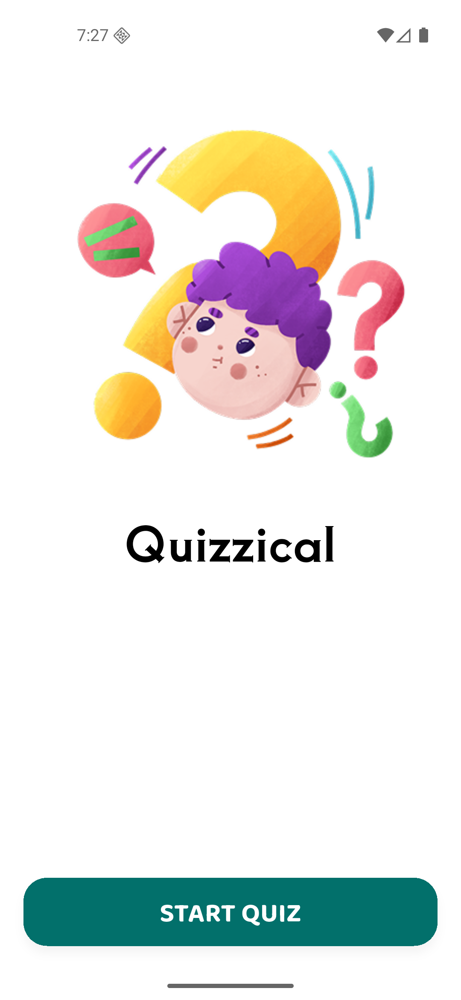
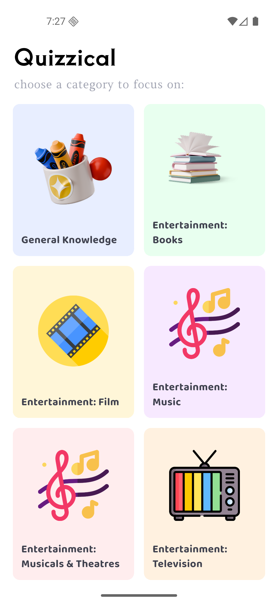
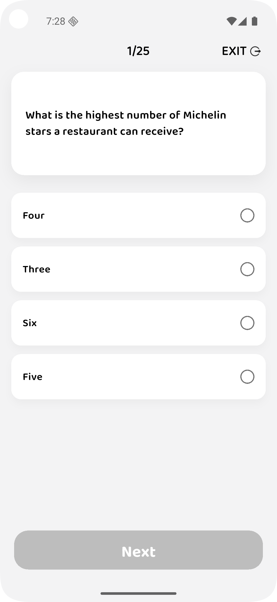
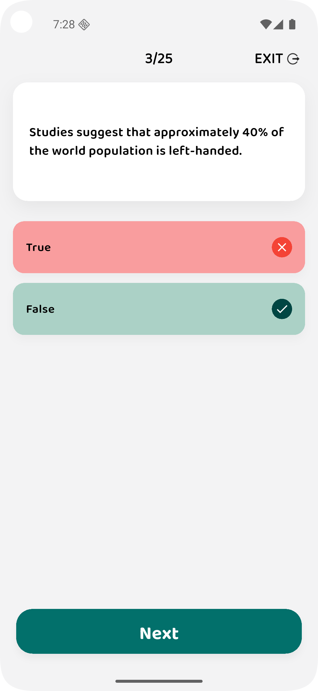
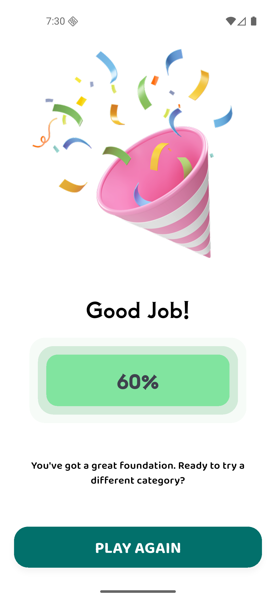

# Quizzical -- Flutter Quiz App

A clean, modular, and scalable **Flutter-based Quiz Application** built using Clean Architecture, GetX state management, and a fully structured layered approach. This project supports multiple environments (dev, stage, prod), category-based quizzes, and a modern UI.

## 🚀 Features

-   Category-wise quiz selection\
-   Dynamic quiz configuration\
-   Interactive quiz play screen\
-   Progress tracking\
-   Score calculation\
-   Beautiful results page\
-   Clean Architecture (Domain → Data → Presentation)\
-   GetX for routing, DI, bindings & controllers\
-   Multi-environment support\
-   Reusable UI components\
-   Base64 Encoding/Decoding for questions & answers
-   API-ready architecture (DIO)

## 📌 Tech Stack

-   **Flutter:** 3.38.1\
-   **Dart:** 3.10.0\
-   **State Management:** GetX\
-   **Networking:** Dio\
-   **Architecture:** Clean Architecture + Feature-first

## 🏗 Project Folder Structure

    lib
    ├── app.dart
    ├── core
    │   ├── app_config.dart
    │   ├── constants
    │   │   ├── app_constants.dart
    │   │   └── assets.dart
    │   ├── helper
    │   │   └── api_checker.dart
    │   ├── interface
    │   │   └── repo_interface.dart
    │   ├── theme
    │   │   ├── app_colors.dart
    │   │   └── app_text_style.dart
    │   └── utils
    │       ├── loader_util.dart
    │       └── toast_util.dart
    ├── data
    │   └── datasource
    │       ├── model
    │       │   ├── api_response.dart
    │       │   ├── error_response.dart
    │       │   └── response_model.dart
    │       └── remote
    │           ├── dio
    │           │   ├── dio_client.dart
    │           │   └── logging_interceptor.dart
    │           └── exception
    │               └── api_error_handler.dart
    ├── di_container.dart
    ├── features
    │   ├── categories
    │   │   ├── domain
    │   │   │   ├── models
    │   │   │   │   └── category_model.dart
    │   │   │   ├── repositories
    │   │   │   │   ├── category_repository.dart
    │   │   │   │   └── category_repository_interface.dart
    │   │   │   └── services
    │   │   │       ├── category_service.dart
    │   │   │       └── category_service_interface.dart
    │   │   └── presentation
    │   │       ├── bindings
    │   │       │   └── category_page_bindings.dart
    │   │       ├── controllers
    │   │       │   └── category_controller.dart
    │   │       ├── pages
    │   │       │   └── category_page.dart
    │   │       └── widgets
    │   │           └── category_card_widget.dart
    │   ├── quiz
    │   │   ├── domain
    │   │   │   ├── models
    │   │   │   │   └── quiz_model.dart
    │   │   │   ├── repositories
    │   │   │   │   ├── quiz_repository.dart
    │   │   │   │   └── quiz_repository_interface.dart
    │   │   │   └── services
    │   │   │       ├── quiz_service.dart
    │   │   │       └── quiz_service_interface.dart
    │   │   └── presentation
    │   │       ├── bindings
    │   │       │   └── quiz_page_bindings.dart
    │   │       ├── controllers
    │   │       │   ├── quiz_controller.dart
    │   │       │   └── quiz_play_controller.dart
    │   │       ├── pages
    │   │       │   ├── quiz_config_page.dart
    │   │       │   ├── quiz_play_page.dart
    │   │       │   └── results_page.dart
    │   │       └── widgets
    │   │           ├── dropdown_item_widget.dart
    │   │           ├── empty_radio_widget.dart
    │   │           ├── exit_quiz_dialogue.dart
    │   │           ├── option_tile_widget.dart
    │   │           ├── result_circle_widget.dart
    │   │           └── score_badge_widget.dart
    │   └── splash
    │       └── presentation
    │           ├── bindings
    │           │   └── splash_page_binding.dart
    │           ├── controllers
    │           │   └── splash_controller.dart
    │           ├── pages
    │           │   ├── splash_page.dart
    │           │   └── welcome_page.dart
    │           └── widgets
    │               └── illustration_widget.dart
    ├── main_common.dart
    ├── main_dev.dart
    ├── main_prod.dart
    ├── main_stage.dart
    ├── routes
    │   └── app_pages.dart
    └── shared
    └── widgets
    └── primary_button_widget.dart


## ▶️ How to Run the Project

### Development

``` bash
flutter run --flavor dev -t lib/main_dev.dart 
```

### Staging

``` bash
flutter run --flavor stage -t lib/main_stage.dart
```

### Production

``` bash
flutter run --flavor prod -t lib/main_prod.dart
```

## 🖼 Screenshots

### 📌 Home Screen


### 📌 Category Selection


### 📌 Quiz Play



### 📌 Results Page


## 🧑‍💻 Author

Name: ABU UBAIDA\
Email: developer.ubaida@gmail.com

## 📄 License

MIT License
